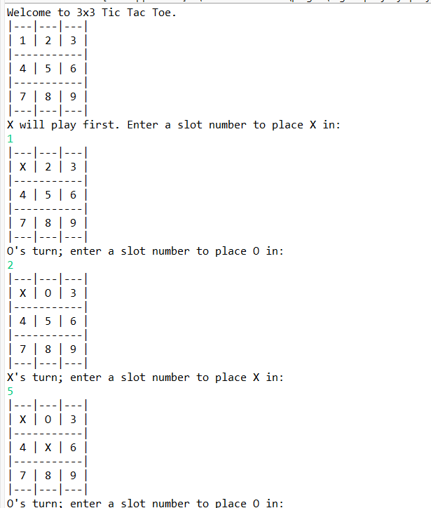
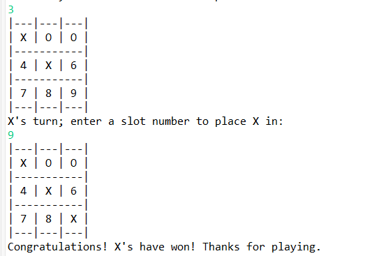

# 🎮 Tik Tac Toe Game (Java Console)

A simple **3x3 Tic Tac Toe** game built in Java, played in the console by two players.

## 📜 Features
- Two players: `X` and `O`
- Automatically checks for winner or draw
- Simple console-based interface

## 🛠 How to Run
1. Open terminal / CMD.
2. Navigate to the `src` folder.
3. Compile the Java file:
   ```bash
   javac com/PuzzleGame/Game.java
   ```
4. Run the program:
   ```bash
   java com.PuzzleGame.Game
   ```

## 🖼 Sample Output
Here is a sample gameplay:

### Start of the game:


### Winning moment:


## 📂 Project Structure
```
TicTacToeGame/
│
├── src/com/PuzzleGame/Game.java
├── screenshots/output1.png
└── screenshots/output2.png
```
